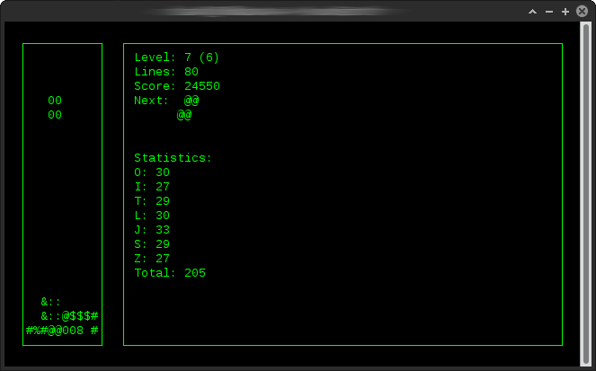

# C-Tetris
C-Tetris is a tetris clone written in C. The user interface is implemented with ncurses. This project is made just for fun and practice.

Some of the implemented features:
- High scores
- Different randomisers:
  - 7-bag
  - TGM
  - Random
- Ghost piece
- Hard drop



## Compiling
Make sure you have installed the package  ```libncurses5-dev``` on your system. To compile just run ```make``` in the repository root. Compiled program will be located in ./build directory.

Compiling and running:
```bash
make && ./build/tetr
```

## Controls
Ncurses key mapping:

Key   | Action
:----:|-------
w     | Rotate piece clock wise
a     | Move piece to left
s     | Move piece to right
d     | Drop piece by one
space | Hard drop
q     | Quit/End game
r     | New game (High score view only)

## Known issues
List of known issues:
- Randomiser can only be changed by modifying source code
- Random seed isn't initialized atm
- High score sorting is bad
