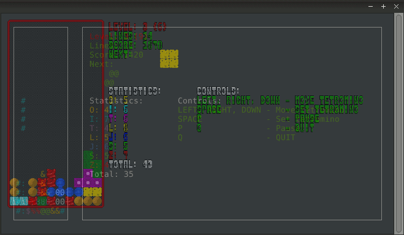

# C-Tetris
C-Tetris is a tetris clone written in C. The user interface can be chosen between SDL and curses. C-Tetris is able to record games and pressed keys can be displayed during the demo playback.

This project is made just for fun and practice.

## Features
Some of the already implemented features:
- High scores
- Demo recording
- Demo playback with changeable time scale variable
- Different randomisers:
  - 7-bag
  - TGM
  - Random
- Ghost piece
- Hard drop
- Wall kick
- User interfaces:
  - SDL
  - Curses

##Screenshots


## Compiling
Make sure you have installed the package  ```libncurses5-dev``` and ```libsdl2-dev``` on your system. To compile just run ```make``` in the repository root. Compiled program will be located in ./build directory.

Compiling and running:
```bash
make && ./build/tetr
```

If you want to compile C-Tetris without SDL interface use ```make only-curses```.

## Command line help
```
Usage: tetr [options]
General Options:
   --help, -h                  Display this information
   --demo, -d <path>           Play given demo record
   --showkeys <0|1> 	       Show pressed keys during demo playback
   --randomiser, -r <name>     Set randomiser used. Where name is 7bag, tgm or random
   --srand <seed>              Set seed used by randomiser
   --UI <UI>                   Set UI used, see below

UIs:
 curses
   --no-color                  Disables colors in terminal
   --set-symbols <str>         Set tetromino symbols. default="0#$&8@%"
 SDL
   --no-textures               Disables texture loading, except for font
   --width <w>, --height <h>   Set window size
   --das <delay-ms>            Auto repeat start delay. default=100
   --arr <delay-ms>            Auto repeat rate delay. default=50
```
